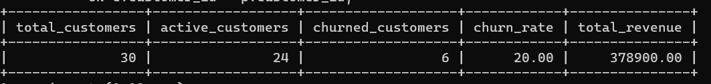
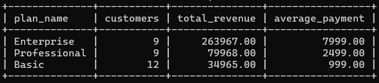
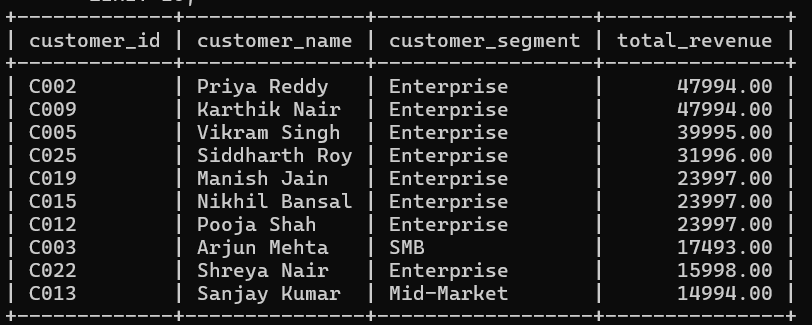

# ☁️ CloudFlow SaaS Customer Churn & Revenue Analytics

## 📌 Project Overview

CloudFlow is a simulated SaaS subscription company offering Basic, Professional, and Enterprise plans.

This project analyzes customer subscriptions, payments, revenue, churn, customer segments, and subscription behavior using **MySQL and advanced SQL**.

The goal is to transform raw SaaS transaction data into meaningful business insights that can support customer retention, revenue growth, and subscription strategy.

---

## 🎯 Business Objectives

The project focuses on answering key business questions:

- What is the total revenue generated by CloudFlow?
- Which subscription plans generate the most revenue?
- Which customer segments generate the most revenue?
- Which customers are the highest-value customers?
- Which subscription plans have the highest churn?
- Which customer segments have the highest churn?
- Which customers generate above-average revenue?
- How does revenue change month over month?
- What is the cumulative revenue over time?
- Which customers upgraded their subscriptions?
- Which high-value customers have churned?
- Where should the business focus its retention and upselling efforts?

---

## 🗂️ Dataset

This project uses a simulated SaaS subscription dataset.

The dataset contains:

- **30 customers**
- **3 subscription plans**
- **30 subscriptions**
- **100 payment records**
- **20 subscription events**

### Database Tables

| Table | Description |
|---|---|
| `customers` | Customer information, signup details, country, and customer segment |
| `plans` | Subscription plans and monthly pricing |
| `subscriptions` | Customer subscription details, start/end dates, and status |
| `payments` | Payment transactions and payment status |
| `subscription_events` | Subscription upgrades, downgrades, renewals, and other events |

---

## 🛠️ Technologies Used

- **MySQL**
- **SQL**
- **MySQL Workbench**
- **Git**
- **GitHub**

---

# 📊 Analysis Results

## 1. Executive KPIs

The initial analysis produced the following business-level KPIs:

| KPI | Result |
|---|---:|
| Total Customers | 30 |
| Active Customers | 24 |
| Churned Customers | 6 |
| Churn Rate | 20.00% |
| Total Revenue | ₹378,900 |



### Insight

CloudFlow has **30 customers**, of which **24 are active and 6 have churned**, resulting in an overall churn rate of **20%**.

The business generated **₹378,900** in successful payment revenue.

---

# 💰 Revenue Analysis

## 2. Revenue by Subscription Plan

| Plan | Customers | Total Revenue | Average Payment |
|---|---:|---:|---:|
| Enterprise | 9 | ₹263,967 | ₹7,999 |
| Professional | 9 | ₹79,968 | ₹2,499 |
| Basic | 12 | ₹34,965 | ₹999 |



### Insight

The **Enterprise plan is the primary revenue driver**.

Enterprise has only **9 customers**, compared with 12 customers on Basic, but generates **₹263,967**, representing approximately **69.7% of total revenue**.

### Business Recommendation

CloudFlow should prioritize:

- Enterprise customer retention
- Enterprise account management
- Enterprise upselling
- Early identification of Enterprise churn risk

---

## 3. Revenue by Customer Segment

| Customer Segment | Customers | Total Revenue | Revenue per Customer |
|---|---:|---:|---:|
| Enterprise | 9 | ₹263,967 | ₹29,329.67 |
| Mid-Market | 8 | ₹62,475 | ₹7,809.38 |
| SMB | 13 | ₹52,458 | ₹4,035.23 |

### Insight

Enterprise customers generate significantly higher revenue per customer than Mid-Market and SMB customers.

Enterprise customers represent only **30% of the customer base** but contribute approximately **70% of total revenue**.

### Business Recommendation

The company should focus its retention and expansion strategy on high-value Enterprise accounts.

---

# 👥 Customer Analysis

## 4. Top 10 Customers by Revenue

The project identifies the highest-value customers based on successful payment revenue.

The top customers include:

| Customer | Segment | Revenue |
|---|---|---:|
| Priya Reddy | Enterprise | ₹47,994 |
| Karthik Nair | Enterprise | ₹47,994 |
| Vikram Singh | Enterprise | ₹39,995 |
| Siddharth Roy | Enterprise | ₹31,996 |
| Manish Jain | Enterprise | ₹23,997 |

### Insight

The highest-revenue customers are primarily from the **Enterprise segment**.



### Business Recommendation

High-value customers should receive stronger retention programs because losing a small number of large accounts can have a significant impact on total revenue.

---

# 📉 Churn Analysis

## 5. Churn Rate by Subscription Plan

| Plan | Customers | Churned Customers | Churn Rate |
|---|---:|---:|---:|
| Professional | 9 | 2 | 22.22% |
| Enterprise | 9 | 2 | 22.22% |
| Basic | 12 | 2 | 16.67% |

### Insight

Professional and Enterprise plans have the highest churn rate at **22.22%**.

However, Enterprise churn is particularly important because Enterprise customers generate the majority of CloudFlow's revenue.

### Business Recommendation

CloudFlow should investigate:

- Cancellation reasons
- Customer satisfaction
- Product usage
- Pricing concerns
- Renewal behavior
- Support issues

for Enterprise and Professional customers.

---

## 6. Overall Customer Churn

The overall customer analysis shows:

```text
Total Customers     → 30
Active Customers    → 24
Churned Customers   → 6
Overall Churn Rate  → 20%